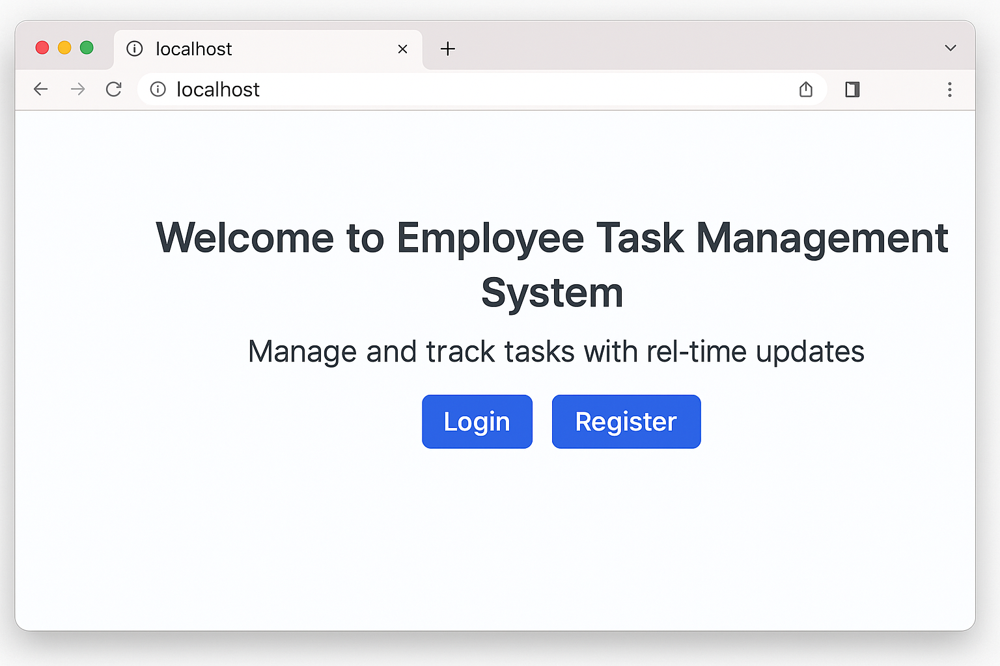
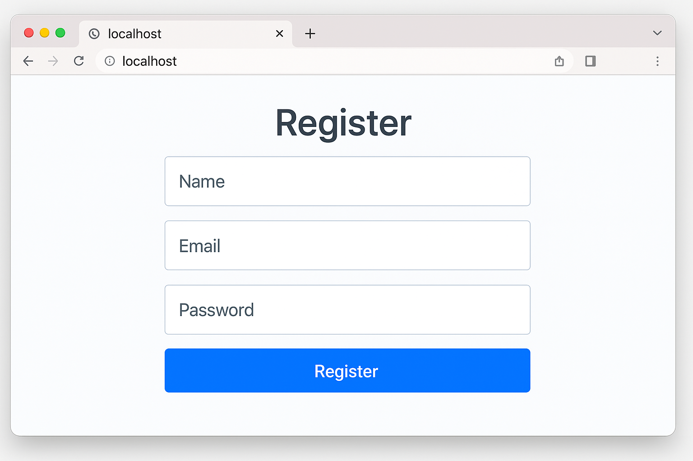
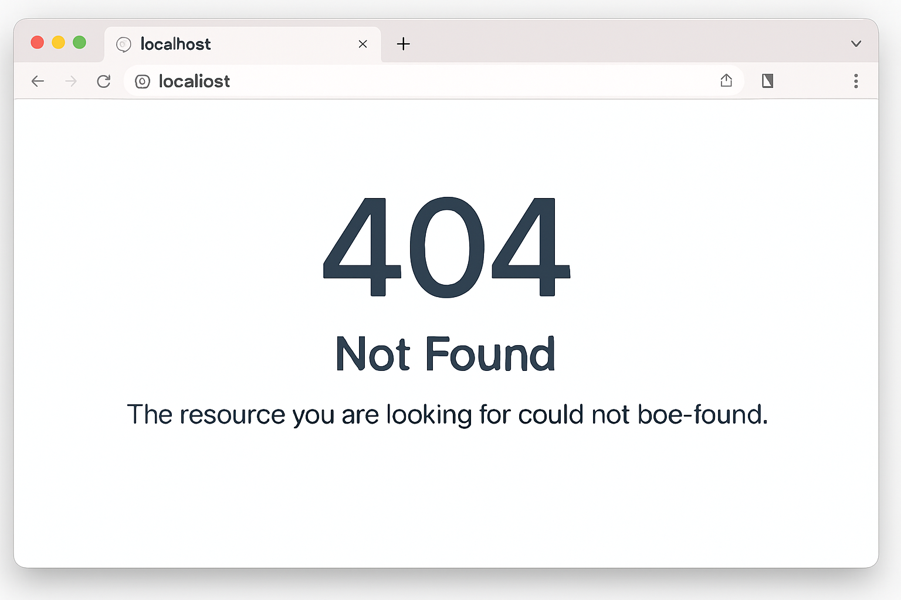

# Employee Task Management System

A full-stack web application built using **.NET Core** and **React** that enables organizations to assign, track, and manage employee tasks efficiently. The system supports **real-time updates via SignalR**, secure **role-based access**, and scalable deployment via **Azure App Services**.

---

## Tech Stack

| Layer       | Technology                              |
|-------------|------------------------------------------|
| Frontend    | React, JavaScript, Axios, SignalR JS     |
| Backend     | ASP.NET Core Web API                     |
| Real-time   | SignalR                                  |
| Database    | Azure SQL Database                       |
| Deployment  | Azure App Services                       |
| Authentication | JWT + Role-Based Authorization       |

---

## Features

- **Role-based access** (Admin / Manager / Employee)
- **Task assignment, update & tracking**
- **Real-time notifications** using SignalR
- **Dashboard with task status & filters**
- **Secure authentication and authorization**
- **Cloud-hosted backend & database** via Azure
- **Responsive UI** (mobile-friendly)

---

## Screenshots

| Home Page | Dashboard Page | Register Page | Login Page | Create Task Page | 404 Page |
|------------|-----------|-------------|-------------|-------------|------------|
|  |  |  |  |  |  |


---

## Getting Started

### Prerequisites

- [.NET 8 SDK](https://dotnet.microsoft.com/)
- [Node.js & npm](https://nodejs.org/)
- [SQL Server / Azure SQL DB]
- [Visual Studio or VS Code](https://code.visualstudio.com/)
- Azure CLI (if deploying to Azure)

---

### Backend Setup (`/backend`)

```bash
cd backend

# Restore & run
dotnet restore
dotnet ef database update  # If using EF migrations
dotnet run
```
---

### Frontend Setup (/frontend)

```bash
cd frontend

# Install dependencies
npm install

# Start dev server
npm start
```
---

### Environment Variables
Backend - appsettings.json

```bash
{
  "ConnectionStrings": {
    "DefaultConnection": "your-azure-sql-connection-string"
  },
  "JwtSettings": {
    "Secret": "your-secret-key"
  }
}

```
---

## Project Structure

```bash
├── backend
│   ├── Controllers/
│   ├── Models/
│   ├── Services/
│   ├── Hubs/
│   └── Program.cs
│
├── frontend
│   ├── public/
│   ├── src/
│   │   ├── Components/
│   │   ├── pages/
│   │   ├── Services/
│   │   └── App.js, index.js
│
├── screenshots/
├── README.md
├── LICENSE
└── .gitignore

```
---

## Testing

- Backend: Use [xUnit](https://xunit.net/) or MSTest for unit/integration tests.
- Frontend: Use [Jest](https://jestjs.io/) + [React Testing Library](https://testing-library.com/)

---

## Deployment (Azure)

1. Push backend to Azure App Service (via VS or CLI)

2. Deploy React frontend via Vercel, Netlify, or Azure Static Web App

3. Update CORS and SignalR base URLs accordingly

---

## Contributing

1. Fork the repo
2. Create a branch (git checkout -b feature/feature-name)
3. Commit your changes (git commit -m 'add feature')
4. Push and open a PR

---

## License

This project is licensed under the MIT License - see the [LICENSE](LICENSE) file for details.

---

## Author

Samiksha Mone

.NET Full Stack Developer

[LinkedIn](www.linkedin.com/in/samiksha-mone-8a23b7182)

---
