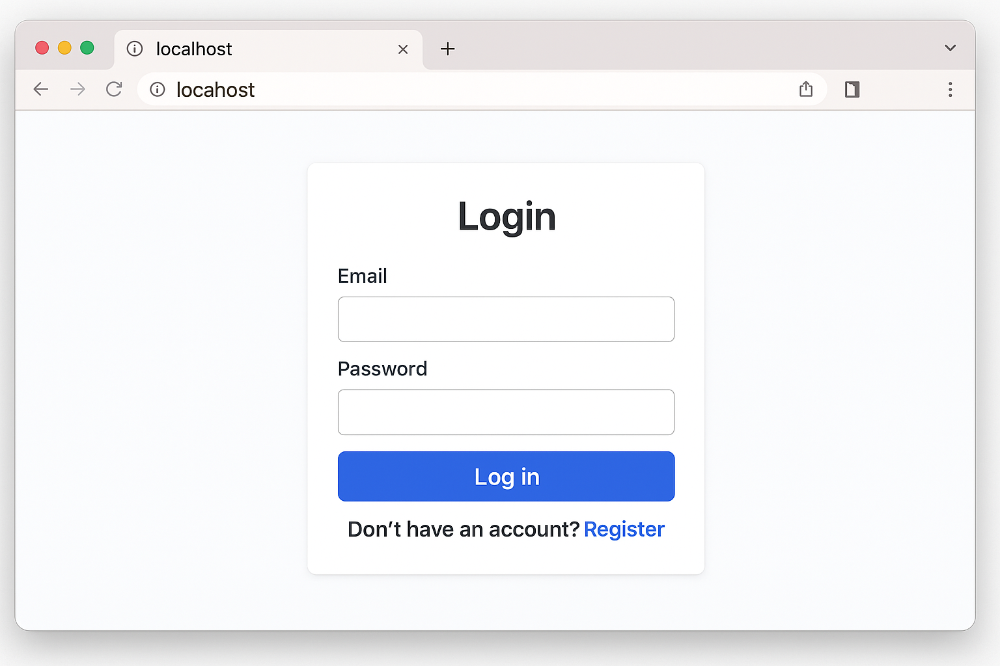

# Employee Task Management System

A full-stack web application built using **.NET Core** and **React** that enables organizations to assign, track, and manage employee tasks efficiently. The system supports **real-time updates via SignalR**, secure **role-based access**, and scalable deployment via **Azure App Services**.

---

## Tech Stack

| Layer       | Technology                              |
|-------------|------------------------------------------|
| Frontend    | React, JavaScript, Axios, SignalR JS     |
| Backend     | ASP.NET Core Web API                     |
| Real-time   | SignalR                                  |
| Database    | Azure SQL Database                       |
| Deployment  | Azure App Services                       |
| Authentication | JWT + Role-Based Authorization       |

---

## Features

- **Role-based access** (Admin / Manager / Employee)
- **Task assignment, update & tracking**
- **Real-time notifications** using SignalR
- **Dashboard with task status & filters**
- **Secure authentication and authorization**
- **Cloud-hosted backend & database** via Azure
- **Responsive UI** (mobile-friendly)

---

## Screenshots

| Login Page | Dashboard | Create Task |
|------------|-----------|-------------|
|  |  |  |


---

## Getting Started

### 🔗 Prerequisites

- [.NET 8 SDK](https://dotnet.microsoft.com/)
- [Node.js & npm](https://nodejs.org/)
- [SQL Server / Azure SQL DB]
- [Visual Studio or VS Code](https://code.visualstudio.com/)
- Azure CLI (if deploying to Azure)

---

### 🛠️ Backend Setup (`/backend`)

```bash
cd backend

# Restore & run
dotnet restore
dotnet ef database update  # If using EF migrations
dotnet run
```
---

### Frontend Setup (/frontend)

```bash
cd frontend

# Install dependencies
npm install

# Start dev server
npm start
```
---

### Environment Variables
Backend - appsettings.json

```bash
{
  "ConnectionStrings": {
    "DefaultConnection": "your-azure-sql-connection-string"
  },
  "JwtSettings": {
    "Secret": "your-secret-key"
  }
}

```
---

## Project Structure

```bash
├── backend
│   ├── Controllers/
│   ├── Models/
│   ├── Services/
│   ├── Hubs/
│   └── Program.cs
│
├── frontend
│   ├── public/
│   ├── src/
│   │   ├── Components/
│   │   ├── pages/
│   │   ├── Services/
│   │   └── App.js, index.js
│
├── screenshots/
├── README.md
├── LICENSE
└── .gitignore

```
---

## Testing

- Backend: Use xUnit or MSTest for unit/integration tests.
- Frontend: Use Jest + React Testing Library

---
