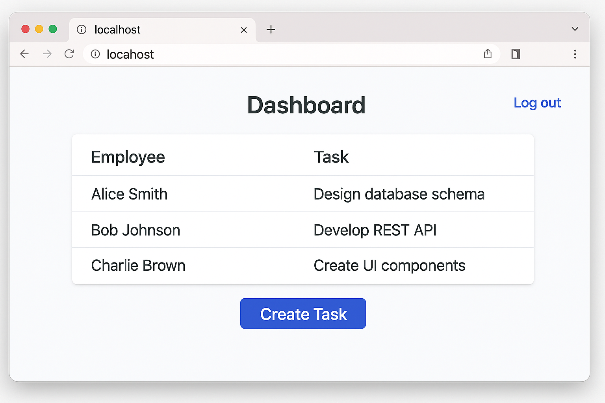

# 🧑‍💼 Employee Task Management System

A full-stack web application built using **.NET Core** and **React** that enables organizations to assign, track, and manage employee tasks efficiently. The system supports **real-time updates via SignalR**, secure **role-based access**, and scalable deployment via **Azure App Services**.

---

## 🔧 Tech Stack

| Layer       | Technology                              |
|-------------|------------------------------------------|
| Frontend    | React, JavaScript, Axios, SignalR JS     |
| Backend     | ASP.NET Core Web API                     |
| Real-time   | SignalR                                  |
| Database    | Azure SQL Database                       |
| Deployment  | Azure App Services                       |
| Authentication | JWT + Role-Based Authorization       |

---

## ✨ Features

- 👤 **Role-based access** (Admin / Manager / Employee)
- ✅ **Task assignment, update & tracking**
- 🔄 **Real-time notifications** using SignalR
- 📊 **Dashboard with task status & filters**
- 🔐 **Secure authentication and authorization**
- ☁️ **Cloud-hosted backend & database** via Azure
- 📱 **Responsive UI** (mobile-friendly)

---

## 📸 Screenshots

| Login Page | Dashboard | Create Task |
|------------|-----------|-------------|
|  |  |  |


---

## 🚀 Getting Started

### 🔗 Prerequisites

- [.NET 8 SDK](https://dotnet.microsoft.com/)
- [Node.js & npm](https://nodejs.org/)
- [SQL Server / Azure SQL DB]
- [Visual Studio or VS Code](https://code.visualstudio.com/)
- Azure CLI (if deploying to Azure)

---

### 🛠️ Backend Setup (`/backend`)

```bash
cd backend

# Restore & run
dotnet restore
dotnet ef database update  # If using EF migrations
dotnet run
```
---

### Frontend Setup (/frontend)

```bash
cd frontend

# Install dependencies
npm install

# Start dev server
npm start
```
